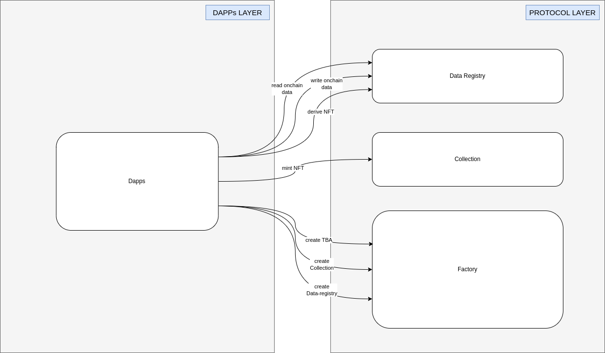

# Architecture

The current architecture of NFT2.0 is depicted in the following diagram.

<figure><figcaption>
Protocol architecture
</figcaption></figure>

There are two distinct layers: Protocol layer and Dapps layer. We will examine each one in detail below.

## Protocol layer

Protocol layer facilitates all necessary components for Dapps to utilize NFT2.0, which include:

1. Factory: enable Dapp to create NFT collections, Data-Registry, Derived accounts, Token bound account (ERC6551Account). It also manages a self-registry in order to lookup all aforementioned entities.
2. Collection: NFT2.0 collections that comply with ERC721 standard and other widely adopted standards such as ERC2981 and ERC1155. Dapps can opt-in to configure NFT collection to comply with some less popular standard, e.g. Soul-bound-token, Semi-transferable (our proprietary standard).
3. Data Registry: provide onchain data storage, serving as an onchain database for NFT data. The data registry is also responsible for creating the derivative NFT and derived account, where royalty commissions are accrued.

Protocol layer also supports additional supplementary components, including:

1. DerivedAccount: a customized, non-executable ERC6551Account for derivative NFTs. It accrues royalty commissions and allows withdrawal in a permissionless manner. Royalty commissions are intentionally diverted to the derived account to ensure proper distribution between the NFT owner and creator. Anyone can claim royalties from the derived account by paying sufficient gas fees, resulting in a pro-rata distribution to the NFT owner and creator.
2. Token Bound Account (aka TBA): a fully fledged version of ERC6551Account that complies with ERC721Receiver and ERC1155Receiver interfaces.
3. Addons: add-ons for ERC721 collections, including but not limited to: Whitelisted freemint.

## Dapps layer

Dapps layer includes Dapps that utilize NFT2.0 protocol. Leveraging protocol, Dapps will be able to perform following actions permissionlessly:

* Create NFT collections
* Create Data Registry
* Mint NFT within collections
* Write / read NFT onchain data (to Data Registry)
* Derive NFTs
* Create Token bound account (aka TBA) for NFTs

