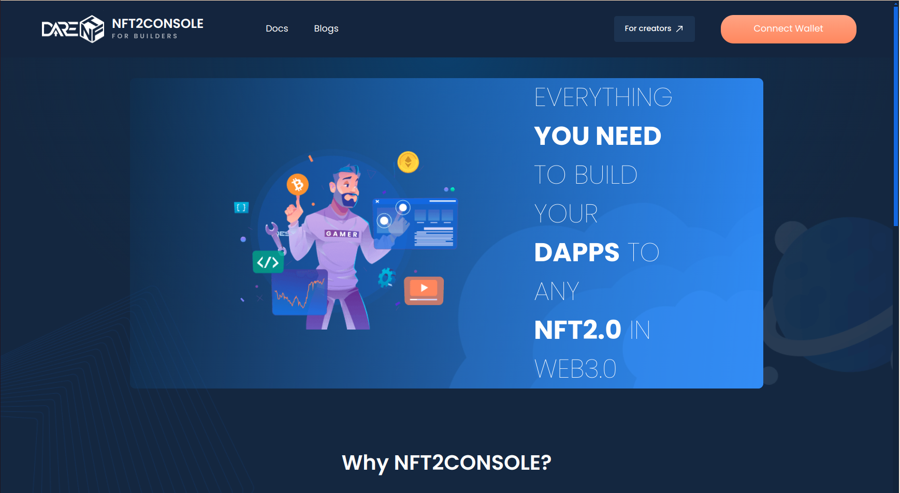

# Create Console Account

### Create Console Account&#x20;

The first thing that you (as a Game Provider) need to do to get started with DareNFT Protocol is to create an account and register onchain.

If you already have a Game ID, feel free to skip ahead to Manage API key.

### Connect wallet

You just connect wallet to **NFT2 Console**, the console account will automatically created.

1. Go to [NFT2 Console](https://nft2scan.com/console/).
2. Click **Connect wallet**.
3. Sign from your wallet.
4. Wallet is connected, then the Game ID is auto-generated for the account.

<figure><figcaption>
Console connect wallet
</figcaption></figure>

<mark style="color:red;">**(!)**</mark> <mark style="color:yellow;">Your account can connect to only 01 wallet address on 01 chain, which CANNOT be changed once connected. Remember to select the correct wallet to connect!</mark>&#x20;

<mark style="color:red;">**(!)**</mark> <mark style="color:yellow;">On each chain, your account will be individual from other chain. So remember to reconnect wallet and register again every time you switch chain!</mark>
