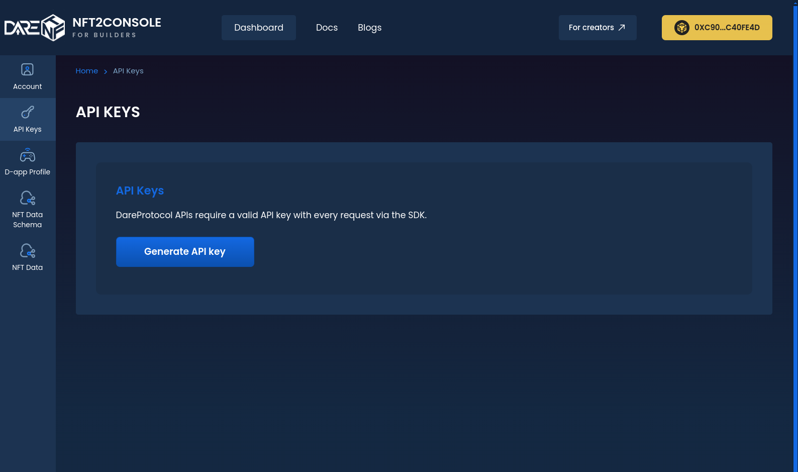

# Manage API key

The API key grants access to the DareNFT Protocol SDK or APIs, which allows you to send requests or queries via the Protocol as Game Provider.

To manage your key, navigate to **Console** > **Dashboard** > **API Keys**.

### Generate API key 

A new Game account has got no API key by default. You would need to generate one for later use in SDK as mentioned in [Configure the SDK](https://nft2scan.com/docs/darenft-protocol/get-started/initialize-the-sdk/#configure-the-sdk).

<figure><figcaption>
Generate API Key
</figcaption></figure>

<mark style="color:red;">**(!)**</mark> <mark style="color:yellow;">DO NOT share the API key, as it provides access to all the features accessible by you as Game Provider on DareNFT Protocol.</mark>

### Revoke API key

**Note:** For now, we limit each Game ID to only 01 API key at a time.

In case you want to revoke the current API key, just delete it then generate another one. The deleted API key can no longer access the Protocol.

<figure><figcaption>
Delete API Key
</figcaption></figure>
