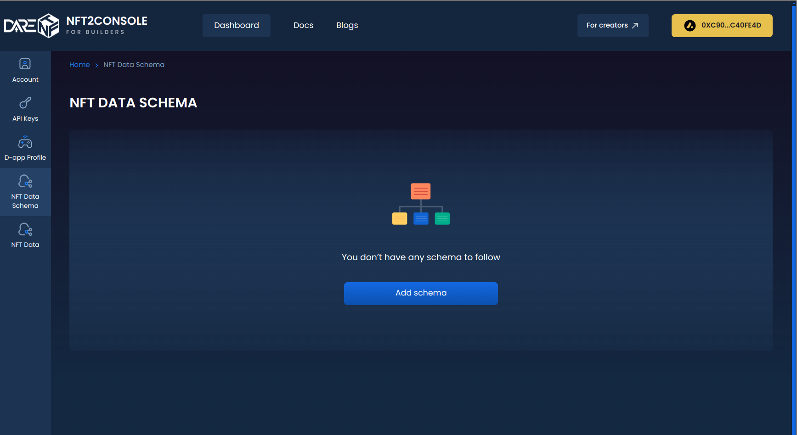
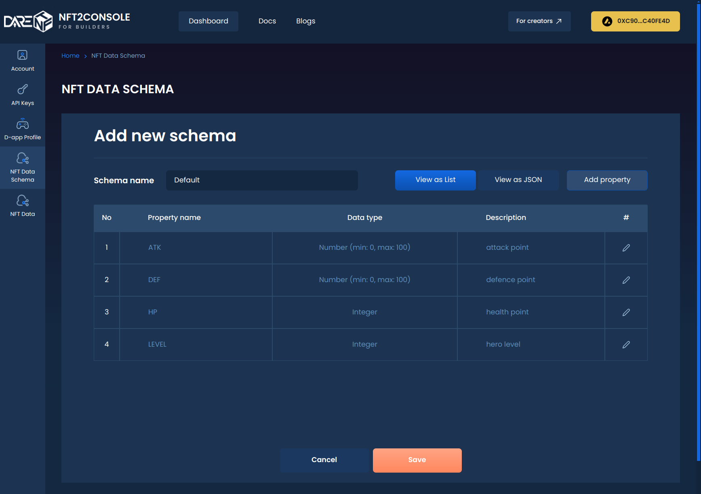
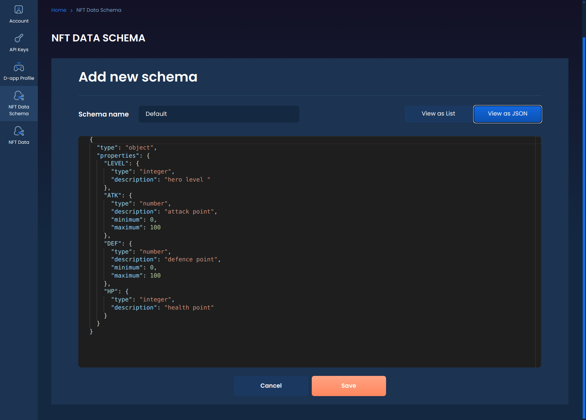

# Set up metadata schema

### Overview

In traditional web2 games, game data such as game characters, game items and other game assets are created, updated and stored by the Game Provider. That means the assets can "die" when the game itself is no longer on service. However, in web3 games, players can truly OWN their game assets - in the form of Non-Fungible Tokens. Game data like character properties or item characteristics will be stored on blockchain as metadata of the NFTs, instead of in some whatever game server.

When players play your game, in-game data will regularly be updated into NFT metadata, which could be triggered by the player or the game system. The Protocol will inquire the in-game data from the Game Provider and push it on blockchain as game metadata of the NFT.

The article guides you to set up the data schema of the game assets before you can use the SDK.

### Define metadata schema <a href="#define-metadata-schema" id="define-metadata-schema"></a>

Navigate to **Console** > **Dashboard** > **NFT Data Schema**. Here you can see the data schema of your game. For now, each Dapp ID can define only 01 data schema.

<figure><figcaption><p>Add data schema</p></figcaption></figure>

Data schema is defined in format of JSON, to list out all the game properties of the NFTs and their data type. This is to validate the payload whenever the NFT is updated with your game metadata. You can define one-by-one property in the "View as List" form, then Console will generate the JSON schema for you.

<figure><figcaption><p>Define schema key-value</p></figcaption></figure>

Or you can also write your own schema in JSON in "View as JSON" form.

<figure><figcaption><p>JSON schema format</p></figcaption></figure>

A valid data schema should look like:

```json
{
  "type": "object",
  "properties": {
    "LEVEL": {
      "type": "integer",
      "description": "hero level "
    },
    "ATK": {
      "type": "number",
      "description": "attack point",
      "minimum": 0,
      "maximum": 100
    },
    "DEF": {
      "type": "number",
      "description": "defence point",
      "minimum": 0,
      "maximum": 100
    },
    "HP": {
      "type": "integer",
      "description": "health point"
    }
  }
}
```

Save your game data schema, then you can move on to Declare GET in-game data endpoint. You can still update the data schema later.
