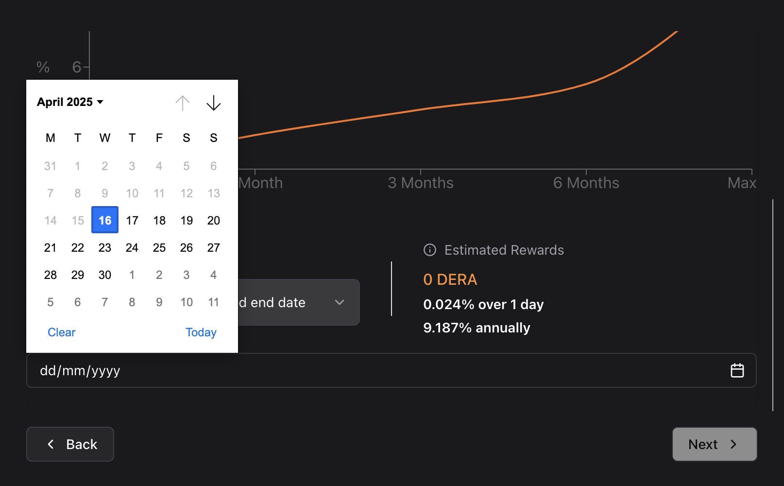

# Validate

## 1. How to Validate?

### 1.1 Connect Wallet to Validate

To start validating on Derachain, you need to connect your wallet first.\
Navigate to **My Staking > Validate** and click **Connect Wallet**.\
This will enable you to create your own validator node and stake tokens securely.

> ⚠️ Make sure your wallet is connected to the Derachain network before proceeding.

<figure><figcaption>
Connect wallet
</figcaption></figure>

### 1.2 Staking Amount

To validate, you need to DERA token and the current available balance will be displayed.

Choose the amount to stake and lock to your validator (note: the amount must be within your available wallet balance).

After entering the amount to validate, click “Next”.

<figure><figcaption>
Step1: Staking amount
</figcaption></figure>

### 1.3 Node Info

Next, you will need to enter your Node information. You will also be required to input your Node’s BLS Public Key and BLS Signature, which will be provided by the Derachain development team.

After entering the above information, click "Next".

<figure><figcaption>
Step2: Node info
</figcaption></figure>

### 1.4 Staking Duration

Next, choose a staking duration. A graph is present to represent the potential reward based on the duration that DERA is staked.

* _NOTE: These estimates are based on the current supply of DERA. Please see the Derachain documentation for more information on rewards calculations._

<figure><figcaption>
Step3: Staking duration
</figcaption></figure>

There are multiple predefined durations available to choose from, as well as a “Custom” option where the user can select a personalized end date for their staking period.

<figure><figcaption>
Select duration
</figcaption></figure>

If choosing a custom date, users are able to select a specific date within the minimum and maximum stake dates from the pop-up calendar.

<figure><figcaption>
Custom date
</figcaption></figure>

### 1.5 Reward Address

After entering their validation duration, the user will choose the address the rewards will pay out to. Users can choose between their connected DeraChain wallet address, or enter a custom address.

After choosing the address for rewards to be sent to, click “Next”.

<figure><figcaption>
Step4: Reward address
</figcaption></figure>

### 1.6 Delegation fee

Next, users will select the delegation fee that will be charged to the delegators when they delegate DERA to this validator. Users can also specify which address they want the delegation rewards to be sent to.

* _NOTE: The minimum delegation fee is 2%. The maximum fee is 100%._

<figure><figcaption>
Step5: Delegation fee
</figcaption></figure>

### 1.7 Review and Confirm Validation

Finally, users will view a summary of their validation information. Users can go back to adjust any submitted information, reset the setup, or complete the validation by hitting the “Submit Validation” button.

<figure><figcaption>
Summary
</figcaption></figure>

Users will then be prompted to confirm the transaction on Metamask extension

<figure><figcaption>
Confirm the transaction on Metamask
</figcaption></figure>

### 1.8 Complete validate

Once completed, users will see their validation was successful. They can then view the transaction information on the [Explorer](https://trace.derachain.com/) or return to [dashboard](https://stake-stg.derachain.com/my-staking).

* _NOTE: After approving the transaction, it may take a few minutes for the Staking to begin._

<figure><figcaption>
Completed validate
</figcaption></figure>

* You can view the details of the newly created node on the [dashboard](https://stake-stg.derachain.com/my-staking):&#x20;

<figure><figcaption>
My staking
</figcaption></figure>

Clicking on the NodeID opens the validator detail page, where all key information about the node is displayed.

<table><thead><tr><th width="148.20001220703125">Ingredient</th><th>Descriptionn</th></tr></thead><tbody><tr><td>Node ID</td><td>A unique identifier for the validator node.</td></tr><tr><td>Ownerd Stake</td><td>Total amount this validator has individually staked at the beginning of the validation period</td></tr><tr><td>Status</td><td>Validator node status</td></tr><tr><td>Duration</td><td>Validator uptime</td></tr><tr><td>Start/ End time</td><td>Validator start/end time</td></tr><tr><td>Countdown</td><td>Time remaining until staking ends (displayed in Days, Hours, Minutes, Seconds)</td></tr><tr><td>Tx Hash</td><td>   Stake transaction hash</td></tr><tr><td>Owner</td><td>Owner of Node</td></tr><tr><td>BLS Public Key/ BLS Signature</td><td>Validator's authentication data</td></tr><tr><td>Delegator Count</td><td>Total number of delegators staking to validator node</td></tr><tr><td>Delegation Fee</td><td>Delegators give validators a portion of their staking rewards as compensation for staking to the validator's active node. Validators set their own delegation fees, with the minimum being 2%</td></tr><tr><td>Delegator Stake</td><td>Total stake delegated to this active validator</td></tr><tr><td>Owned Stake</td><td>Total amount this validator has individually staked at the beginning of the validation period</td></tr><tr><td>Total Stake</td><td>Total amount currently staked to this active validator (Delegator stake + Owned Stake)</td></tr><tr><td>Delegators tab</td><td>Display a table of delegators who have staked with the validator.</td></tr><tr><td>Validation History tab</td><td>Provide data on completed or ongoing validation sessions of the validator.</td></tr><tr><td>Health Check tab</td><td>Show validator status using specific metrics such as status, online availability, accessibility, and responsiveness.</td></tr></tbody></table>

<figure><figcaption>
Validator detail
</figcaption></figure>

## 2. Remove validator

On Dera, removing a validator means exiting the active validator set. This is done by unbonding your self-delegated tokens.

***

### 2.1 When should you remove a validator?

* You no longer want to participate as a validator.
* You want to recover your staked tokens.
* You are shutting down your validator node.

### 2.2 How to remove a validator

To delete your validator node after the staking duration has expired:

1. Go to the **My Staking** page.
2. In the list of your nodes, click the **Delete** button next to the validator you want to remove.
3. A confirmation dialog will appear — make sure you want to proceed.
4. The system will prompt your wallet to **sign a transaction** to confirm the deletion.
5. Once signed, the transaction will be processed and your node will be removed.

> ⚠️ Note: You can only delete a node **after the staking duration you initially set has expired**.&#x20;

<figure><figcaption>
My staking
</figcaption></figure>

<figure><figcaption>
Popup confirm remove validator
</figcaption></figure>

<figure><figcaption>
Remove validator succsess
</figcaption></figure>

⚠️ Note:&#x20;

* Removing your validator does **not** affect delegators directly, but they will stop earning rewards from your node.
* Validators can rejoin by creating a new validator transaction.

### 2.3 What Happens to Your Delegated Tokens?

* Your tokens are **not lost**.
* During this period, you won't earn rewards, and tokens remain locked.
* If you want to clean up your delegation list after a validator is removed, you can manually remove the delegator entry from the UI.
* This also helps release any locked tokens and ensures that the delegation process to that node is fully terminated.

