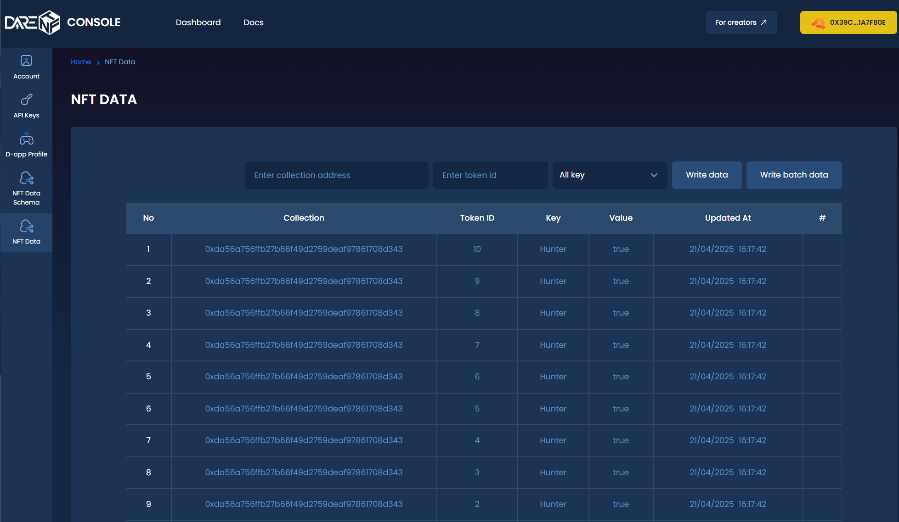

# Validate

## 1. Connect Wallet to Validate

To start validating on Derachain, you need to connect your wallet first.\
Navigate to **My Staking > Validate** and click **Connect Wallet**.\
This will enable you to create your own validator node and stake tokens securely.

> ⚠️ Make sure your wallet is connected to the Derachain network before proceeding.

<figure><figcaption>
Connect wallet
</figcaption></figure>

## 2. Staking Amount

To validate, you need to DERA token and the current available balance will be displayed.

Choose the amount to stake and lock to your validator (note: the amount must be within your available wallet balance).

After entering the amount to validate, click “Next”.

<figure><figcaption>
Step1: Staking amount
</figcaption></figure>

## 3. Node Info

Next, you will need to enter your Node information. You will also be required to input your Node’s BLS Public Key and BLS Signature, which will be provided by the Derachain development team.

After entering the above information, click "Next".

<figure><figcaption>
Step2: Node info
</figcaption></figure>

## 4. Staking Duration

Next, choose a staking duration. A graph is present to represent the potential reward based on the duration that DERA is staked.

* _NOTE: These estimates are based on the current supply of DERA. Please see the Derachain documentation for more information on rewards calculations._

<figure><figcaption>
Step3: Staking duration
</figcaption></figure>

There are multiple predefined durations available to choose from, as well as a “Custom” option where the user can select a personalized end date for their staking period.

<figure><figcaption>
Select duration
</figcaption></figure>

If choosing a custom date, users are able to select a specific date within the minimum and maximum stake dates from the pop-up calendar.

<figure><figcaption>
Custom date
</figcaption></figure>

## 5. Reward Address

After entering their validation duration, the user will choose the address the rewards will pay out to. Users can choose between their connected DeraChain wallet address, or enter a custom address.

After choosing the address for rewards to be sent to, click “Next”.

<figure><figcaption>
Step4: Reward address
</figcaption></figure>

## 6. Delegation fee

Next, users will select the delegation fee that will be charged to the delegators when they delegate DERA to this validator. Users can also specify which address they want the delegation rewards to be sent to.

* _NOTE: The minimum delegation fee is 2%. The maximum fee is 100%._

<figure><figcaption>
Step5: Delegation fee
</figcaption></figure>

## 7. Summary and Submit Validation

Finally, users will view a summary of their validation information. Users can go back to adjust any submitted information, reset the setup, or complete the validation by hitting the “Submit Validation” button.

<figure><figcaption>
Summary
</figcaption></figure>

Users will then be prompted to confirm the transaction on Metamask extension

<figure><figcaption>
Confirm the transaction on Metamask
</figcaption></figure>

## 8. Complete validate

Once completed, users will see their validation was successful. They can then view the transaction information on the [Explorer](https://trace.derachain.com/) or return to Stake.

* _NOTE: After approving the transaction, it may take a few minutes for the Staking to begin._

<figure><figcaption>
Completed validate
</figcaption></figure>

